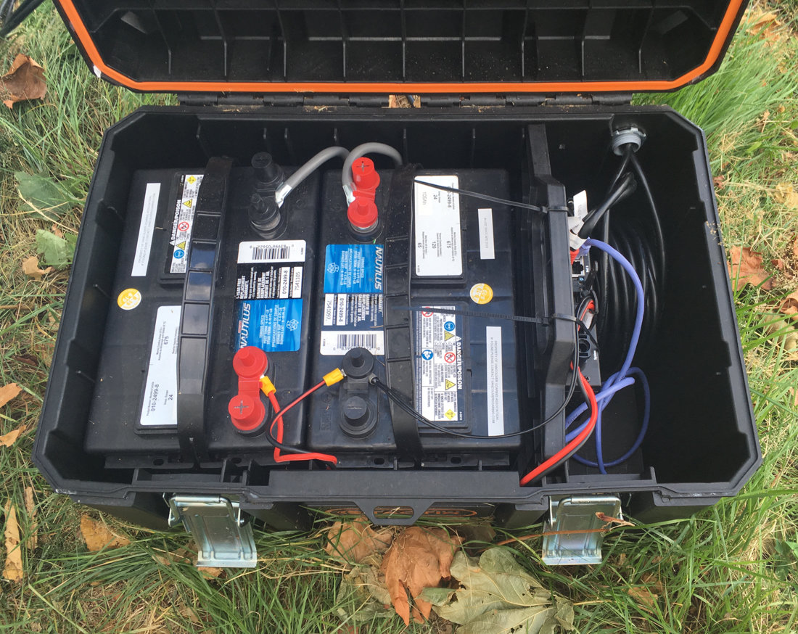

# This project was built with these tools and frameworks:

- [Open Glider Network](https://www.glidernet.org/) for real-time  glider, paraglider, UAV tracking and visibility on the web.
- Check the [OGN Wiki](http://wiki.glidernet.org/start) for technical documentation, and explore the [OGN-RF](https://github.com/glidernet/ogn-rf) code repository.
- [Ubuntu Server](https://ubuntu.com/download/iot/raspberry-pi-2-3) and [Raspbian](https://www.raspberrypi.org/downloads/raspbian/).
- Ubiquiti Networks [PowerBeam AC Gen2](https://www.ui.com/airmax/powerbeam-ac-gen2/) long-range wifi radios.
- [Github](https://www.github.com/) for hosting our [project documentation](https://github.com/beforeyouknowit/vsa-flarm-relay-docs) and development collaboration.
- [Docsify.js](https://docsify.js.org/) for building and maintaining this project's documentation website; documentation written in [Markdown](https://en.wikipedia.org/wiki/Markdown).

### Hardware:
- [Ubiquiti Networks' SunMAX SolarSwitch](https://store.ui.com/collections/solar/products/sunmax-solarswitch), model SM-SW-40. [Read more about our off-grid power system here](/power).
- [Ubiquiti Networks' PowerBeam](https://www.ui.com/airmax/powerbeam-ac-gen2/), model PBE‑5AC‑Gen2, one on either end of our links.
- [Ubiquiti Networks' G3 Flex](https://unifi-protect.ui.com/) 1080p IP camera, on our remote tower.
- [Raspberry Pi 3 Model B+](https://www.raspberrypi.org/products/) as our primary SDR-to-OGN device.
- RTL-SDR R820T2 software defined radio USB dongle, [more info here](https://www.rtl-sdr.com/tag/r820t2/).
- [To be documented:] Remote tower UHF radio antenna.

&nbsp;
&nbsp;

	

