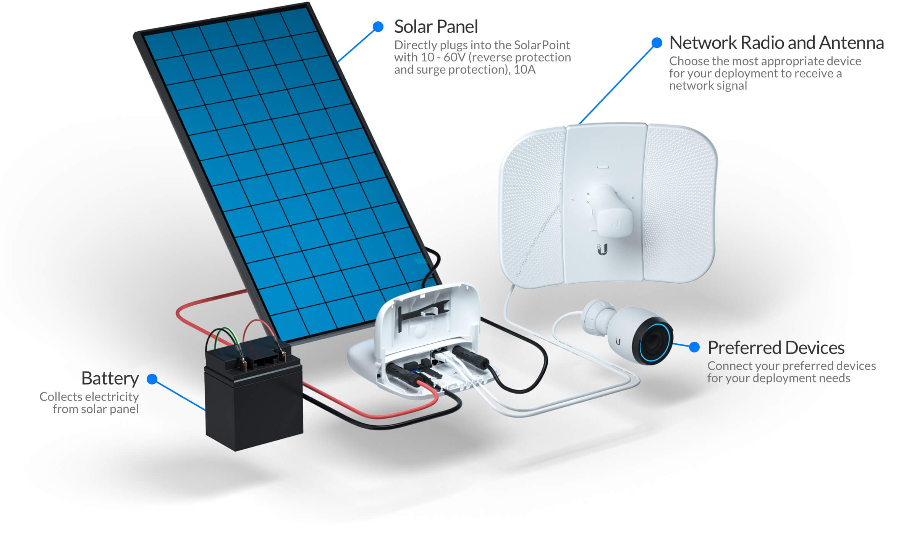
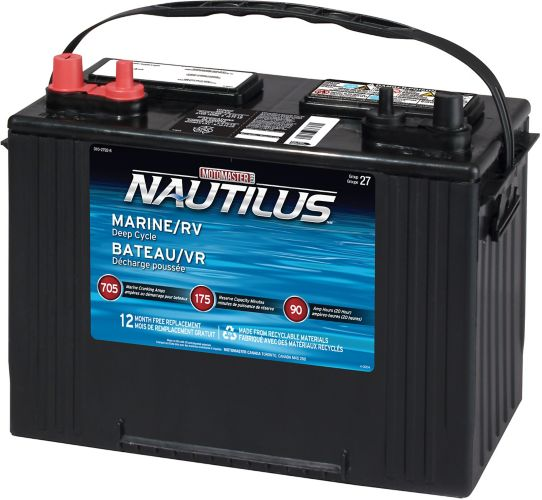

# Off-Grid Power Supply

We're running our station from 2x 100W UBSCO mono-crystalline solar panels, 103cm x 67cm, collecting power at about **17% efficiency.** These are attached to a custom-built extruded aluminum frame, mounted at a 22ºθ angle to the sun.

> This angle was selected so as to optimize spring-summer-fall flying season usage, ignoring most winter sunlight hours when our club doesn't fly or need FLARM situational awareness coverage.

Our power management and distribution is based on Ubiquiti Networks' [SunMAX SolarSwitch](https://solar.ui.com) MPPT battery charge controller, [Power over Ethernet](https://en.wikipedia.org/wiki/Power_over_Ethernet) distribution for our system components, 10/100Mbps ethernet switch, and per-port power scheduling via a web interface.

Here's Ubiquiti's diagram to illustrate a similar deployment to ours:

&nbsp;
&nbsp;
&nbsp;

	

> In our case, we're running 2X (two) Motomaster Nautilus Group 27 **deep-cycle** 12V batteries, with approximately 105AH of power each. On average seasonal charging (spring through fall) this should give us 2-3 weeks of run-time without any charging on our relay station. On average our whole system draws about 8-12W at 5VDC, and we can easily collect 8-15W on overcast and cloudy days.

	

